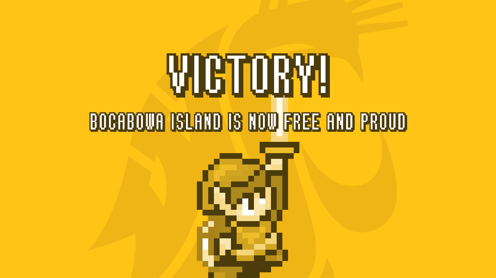

# The Legend of The Crimson King

A stylized game based on an island in the midst of terror.

Built in two weeks for our end of the year project in a C/C++ Data Structures class, using SFML, (team of three).

Thanks to Keagen for making the trailer!
https://www.youtube.com/watch?v=p0F573dvcco

# BUILD
Currently, there is no build for this yet. To run the game you'll need to install SFML and merge the code here.
To install SFML: https://www.youtube.com/watch?v=YfMQyOw1zik

# NOTE
- Collisions and sound are disabled for performance reasons
- The game will close if you die / win

# ARTWORK
- Most artwork in this game is reused from Nintendos Zelda: LTTP / various other sources
- Additional artwork was made by Keagen 

# TOOLS
- Visual Studio 2019 
- Tiled 
- Aseprite 
- Paint.net
- Excel (Tilemap generation)

# SCREENSHOTS

